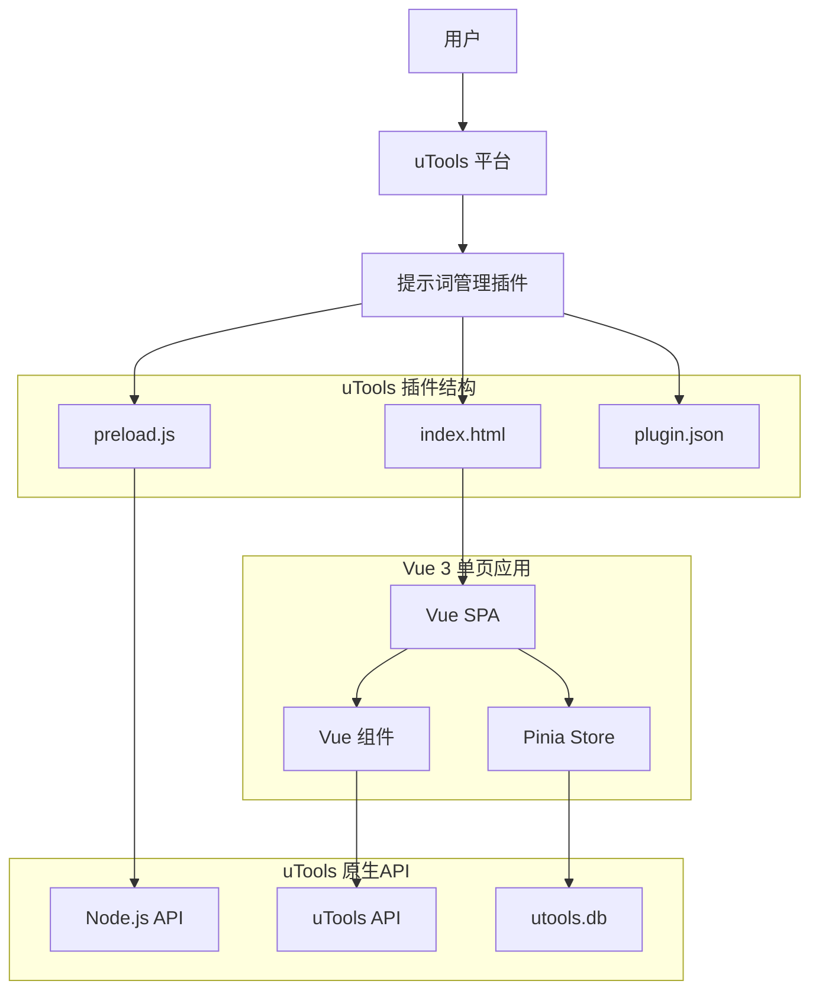
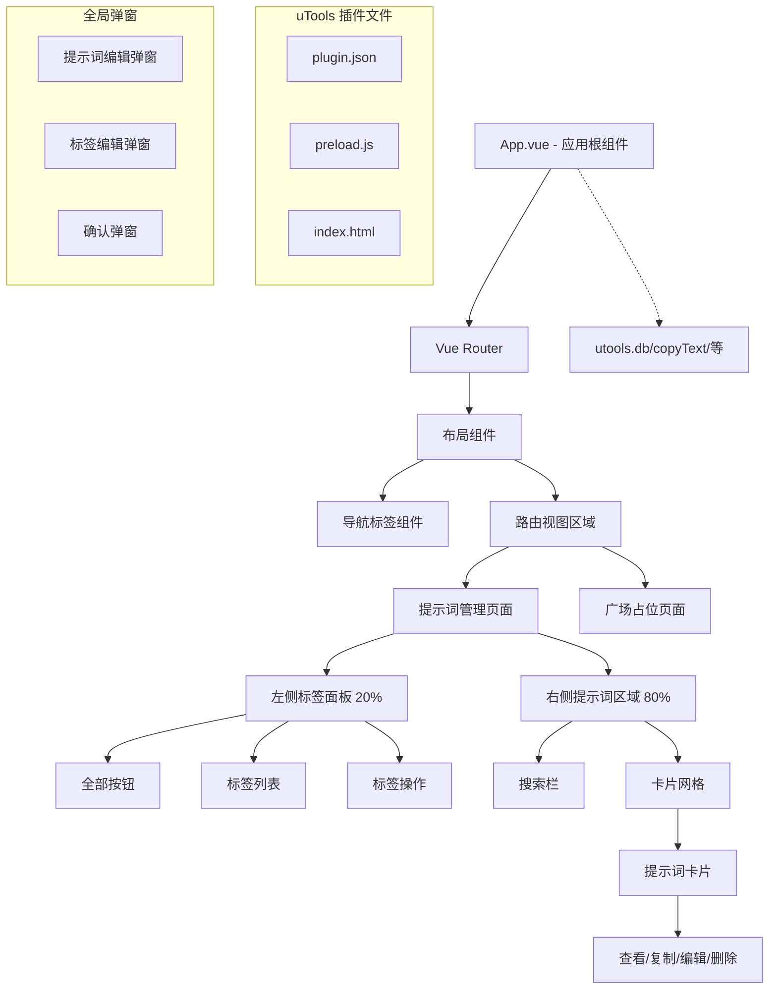

# 提示词管理工具设计文档

## 概述

本设计文档基于已确认的需求文档，为 uTools 提示词管理工具项目提供详细的技术架构和实现方案。项目采用现代前端技术栈，以 Vue 3 + Vite 作为核心框架，结合 uTools API 实现高效的提示词管理功能。

## 架构

### uTools 插件架构



### 技术栈选择

**uTools 插件框架：Vue 3 + Vite**
- 原因：uTools 官方支持 Vue+Vite 工程，开发体验优秀
- 支持：完整的 Vue 生态系统，包括 Vue Router 路由功能
- 优势：支持热重载、TypeScript、现代化开发体验

**数据存储：uTools 原生 API**
- 使用 `utools.db.put/get/remove` 进行数据持久化
- 不需要额外的存储层封装，直接使用原生接口
- 支持云同步（uTools 自动处理）

**状态管理：Pinia**
- 原因：与 uTools API 集成良好，响应式状态管理
- 简化：移除复杂的服务层，直接在 store 中调用 uTools API

**UI 框架：Naive UI**
- 专为 Vue 3 设计，与 uTools 窗口环境兼容良好
- 支持主题定制，可适配 uTools 的视觉风格
- 无需外部 CDN 依赖，符合 uTools 打包要求

### 核心设计原则

1. **模块化设计**：组件、服务、存储分离，便于维护和测试
2. **响应式优先**：充分利用 Vue 3 响应式系统
3. **类型安全**：全面使用 TypeScript，提供类型安全保障
4. **性能优化**：按需加载、虚拟滚动、防抖等优化策略
5. **用户体验**：流畅的交互、明确的反馈、一致的设计语言

## 组件与接口

### uTools 插件组件架构



### 核心组件设计

#### 1. App.vue（应用根组件）
```typescript
// 功能：应用初始化、全局状态管理、路由配置
interface AppProps {
  // 无 props
}

interface AppState {
  isLoading: boolean;
  theme: 'light' | 'dark';
  initialized: boolean;
}
```

#### 2. PromptManager.vue（提示词管理主页面）
```typescript
interface PromptManagerProps {
  // 无 props
}

interface PromptManagerState {
  selectedTagId: string | null;
  searchKeyword: string;
  currentPage: number;
  pageSize: number;
}
```

#### 3. TagPanel.vue（标签面板组件）
```typescript
interface TagPanelProps {
  selectedTagId: string | null;
}

interface TagPanelEmits {
  'tag-select': (tagId: string | null) => void;
  'tag-create': () => void;
  'tag-edit': (tag: Tag) => void;
  'tag-delete': (tagId: string) => void;
}
```

#### 4. PromptCard.vue（提示词卡片组件）
```typescript
interface PromptCardProps {
  prompt: Prompt;
  highlighted?: boolean;
}

interface PromptCardEmits {
  'view': (prompt: Prompt) => void;
  'copy': (prompt: Prompt) => void;
  'edit': (prompt: Prompt) => void;
  'delete': (promptId: string) => void;
}
```

#### 5. PromptDialog.vue（提示词编辑弹窗）
```typescript
interface PromptDialogProps {
  visible: boolean;
  prompt?: Prompt | null;
  mode: 'create' | 'edit' | 'view';
}

interface PromptDialogEmits {
  'update:visible': (visible: boolean) => void;
  'save': (prompt: Prompt) => void;
  'cancel': () => void;
}
```

### uTools API 集成层设计

```typescript
// utils/utoolsAPI.ts - uTools 原生 API 封装
export class UtoolsAPI {
  // 数据存储 - 直接使用 utools.db
  static async getPrompts(): Promise<Prompt[]> {
    const docs = await utools.db.allDocs('prompt/')
    return docs.map(doc => doc.value)
  }
  
  static async savePrompt(prompt: Prompt): Promise<void> {
    await utools.db.put({
      _id: `prompt/${prompt.id}`,
      value: prompt
    })
  }
  
  static async deletePrompt(id: string): Promise<void> {
    await utools.db.remove(`prompt/${id}`)
  }
  
  // 标签操作
  static async getTags(): Promise<Tag[]> {
    const docs = await utools.db.allDocs('tag/')
    return docs.map(doc => doc.value)
  }
  
  static async saveTag(tag: Tag): Promise<void> {
    await utools.db.put({
      _id: `tag/${tag.id}`,
      value: tag
    })
  }
  
  // 系统操作
  static copyToClipboard(text: string): void {
    utools.copyText(text)
    utools.showNotification('已复制到剪贴板')
  }
  
  static hideWindow(): void {
    utools.hideMainWindow()
  }
}

// stores/promptStore.ts - Pinia Store 直接调用 uTools API
export const usePromptStore = defineStore('prompt', () => {
  const prompts = ref<Prompt[]>([])
  
  const loadPrompts = async () => {
    prompts.value = await UtoolsAPI.getPrompts()
  }
  
  const addPrompt = async (prompt: CreatePromptDTO) => {
    const newPrompt: Prompt = {
      id: Date.now().toString(),
      ...prompt,
      createdAt: new Date(),
      updatedAt: new Date(),
      usageCount: 0,
      isFavorite: false
    }
    
    await UtoolsAPI.savePrompt(newPrompt)
    prompts.value.push(newPrompt)
  }
  
  return { prompts, loadPrompts, addPrompt }
})
```

## 数据模型

### 核心数据结构

```typescript
// types/Prompt.ts
export interface Prompt {
  id: string;
  name: string;
  content: string;
  tags: string[]; // 标签ID数组
  source?: string; // 来源链接
  createdAt: Date;
  updatedAt: Date;
  usageCount: number; // 使用次数
  isFavorite: boolean; // 是否收藏
}

export interface CreatePromptDTO {
  name: string;
  content: string;
  tags?: string[];
  source?: string;
}

export interface UpdatePromptDTO {
  name?: string;
  content?: string;
  tags?: string[];
  source?: string;
  isFavorite?: boolean;
}

export interface PromptFilters {
  tagId?: string | null;
  keyword?: string;
  isFavorite?: boolean;
  sortBy?: 'createdAt' | 'updatedAt' | 'usageCount' | 'name';
  sortOrder?: 'asc' | 'desc';
  page?: number;
  pageSize?: number;
}
```

```typescript
// types/Tag.ts
export interface Tag {
  id: string;
  name: string;
  color: string; // 标签颜色
  description?: string;
  createdAt: Date;
  updatedAt: Date;
  promptCount: number; // 关联的提示词数量
}

export interface CreateTagDTO {
  name: string;
  color: string;
  description?: string;
}

export interface UpdateTagDTO {
  name?: string;
  color?: string;
  description?: string;
}
```

```typescript
// types/AppState.ts
export interface AppConfig {
  theme: 'light' | 'dark';
  language: 'zh' | 'en';
  pageSize: number;
  defaultSortBy: string;
  defaultSortOrder: 'asc' | 'desc';
  autoBackup: boolean;
  backupInterval: number; // 自动备份间隔（天）
}

export interface AppState {
  config: AppConfig;
  lastSelectedTagId: string | null;
  searchHistory: string[];
  statistics: {
    totalPrompts: number;
    totalTags: number;
    totalUsage: number;
    lastBackupAt?: Date;
  };
}
```

### 数据存储设计

```typescript
// utils/database.ts
export class Database {
  private static readonly KEYS = {
    PROMPTS: 'prompts',
    TAGS: 'tags',
    CONFIG: 'config',
    STATE: 'state'
  } as const;

  // 提示词相关
  async getPrompts(): Promise<Prompt[]>
  async savePrompts(prompts: Prompt[]): Promise<void>
  
  // 标签相关
  async getTags(): Promise<Tag[]>
  async saveTags(tags: Tag[]): Promise<void>
  
  // 配置相关
  async getConfig(): Promise<AppConfig>
  async saveConfig(config: AppConfig): Promise<void>
  
  // 状态相关
  async getState(): Promise<AppState>
  async saveState(state: AppState): Promise<void>
  
  // 备份与恢复
  async exportData(): Promise<BackupData>
  async importData(data: BackupData): Promise<void>
}

export interface BackupData {
  version: string;
  exportedAt: Date;
  prompts: Prompt[];
  tags: Tag[];
  config: AppConfig;
  state: AppState;
}
```

## 错误处理

### 错误分类与处理策略

```typescript
// types/Error.ts
export enum ErrorType {
  STORAGE_ERROR = 'STORAGE_ERROR',
  VALIDATION_ERROR = 'VALIDATION_ERROR',
  NETWORK_ERROR = 'NETWORK_ERROR',
  PERMISSION_ERROR = 'PERMISSION_ERROR',
  UNKNOWN_ERROR = 'UNKNOWN_ERROR'
}

export interface AppError {
  type: ErrorType;
  code: string;
  message: string;
  details?: any;
  timestamp: Date;
}

// utils/errorHandler.ts
export class ErrorHandler {
  static handle(error: Error | AppError): void {
    // 错误日志记录
    console.error('[Prompt Manager Error]', error);
    
    // 用户友好的错误提示
    const userMessage = this.getUserMessage(error);
    
    // 显示错误提示
    window.$message?.error(userMessage);
    
    // 错误上报（如果需要）
    this.report(error);
  }
  
  static getUserMessage(error: Error | AppError): string {
    if (error instanceof AppError) {
      return this.getErrorMessage(error.type, error.code);
    }
    return '操作失败，请稍后重试';
  }
  
  private static getErrorMessage(type: ErrorType, code: string): string {
    const messages = {
      [ErrorType.STORAGE_ERROR]: {
        'QUOTA_EXCEEDED': '存储空间不足，请清理数据后重试',
        'ACCESS_DENIED': '存储访问被拒绝，请检查权限设置',
        'CORRUPTED_DATA': '数据已损坏，建议恢复备份'
      },
      [ErrorType.VALIDATION_ERROR]: {
        'REQUIRED_FIELD': '请填写必填字段',
        'INVALID_FORMAT': '数据格式不正确',
        'DUPLICATE_NAME': '名称已存在，请使用其他名称'
      },
      [ErrorType.PERMISSION_ERROR]: {
        'CLIPBOARD_ACCESS': '无法访问剪贴板，请检查浏览器权限'
      }
    };
    
    return messages[type]?.[code] || '操作失败，请稍后重试';
  }
}
```

### 防御性编程

```typescript
// utils/validators.ts
export class Validators {
  static validatePrompt(prompt: CreatePromptDTO | UpdatePromptDTO): ValidationResult {
    const errors: string[] = [];
    
    if ('name' in prompt && (!prompt.name || prompt.name.trim().length === 0)) {
      errors.push('提示词名称不能为空');
    }
    
    if ('name' in prompt && prompt.name && prompt.name.length > 100) {
      errors.push('提示词名称不能超过100个字符');
    }
    
    if ('content' in prompt && (!prompt.content || prompt.content.trim().length === 0)) {
      errors.push('提示词内容不能为空');
    }
    
    if ('source' in prompt && prompt.source && !this.isValidUrl(prompt.source)) {
      errors.push('来源链接格式不正确');
    }
    
    return {
      isValid: errors.length === 0,
      errors
    };
  }
  
  static validateTag(tag: CreateTagDTO | UpdateTagDTO): ValidationResult {
    const errors: string[] = [];
    
    if ('name' in tag && (!tag.name || tag.name.trim().length === 0)) {
      errors.push('标签名称不能为空');
    }
    
    if ('name' in tag && tag.name && tag.name.length > 20) {
      errors.push('标签名称不能超过20个字符');
    }
    
    if ('color' in tag && tag.color && !this.isValidColor(tag.color)) {
      errors.push('标签颜色格式不正确');
    }
    
    return {
      isValid: errors.length === 0,
      errors
    };
  }
  
  private static isValidUrl(url: string): boolean {
    try {
      new URL(url);
      return true;
    } catch {
      return false;
    }
  }
  
  private static isValidColor(color: string): boolean {
    const hexRegex = /^#[0-9A-F]{6}$/i;
    return hexRegex.test(color);
  }
}

export interface ValidationResult {
  isValid: boolean;
  errors: string[];
}
```

## 测试策略

### 测试架构

```typescript
// 单元测试 - 业务逻辑
describe('PromptService', () => {
  describe('createPrompt', () => {
    it('should create prompt with valid data', async () => {
      const service = new PromptService();
      const promptData: CreatePromptDTO = {
        name: 'Test Prompt',
        content: 'Test content',
        tags: ['tag1']
      };
      
      const result = await service.createPrompt(promptData);
      
      expect(result.id).toBeDefined();
      expect(result.name).toBe('Test Prompt');
      expect(result.content).toBe('Test content');
    });
    
    it('should throw error for invalid data', async () => {
      const service = new PromptService();
      const invalidData: CreatePromptDTO = {
        name: '',
        content: '',
        tags: []
      };
      
      await expect(service.createPrompt(invalidData)).rejects.toThrow();
    });
  });
});

// 组件测试 - Vue组件
describe('PromptCard', () => {
  it('should render prompt data correctly', () => {
    const prompt: Prompt = {
      id: '1',
      name: 'Test Prompt',
      content: 'Test content',
      tags: ['tag1'],
      createdAt: new Date(),
      updatedAt: new Date(),
      usageCount: 0,
      isFavorite: false
    };
    
    const wrapper = mount(PromptCard, {
      props: { prompt }
    });
    
    expect(wrapper.find('.prompt-name').text()).toBe('Test Prompt');
    expect(wrapper.find('.prompt-content').text()).toContain('Test content');
  });
  
  it('should emit copy event when copy button clicked', async () => {
    const prompt: Prompt = createMockPrompt();
    const wrapper = mount(PromptCard, {
      props: { prompt }
    });
    
    await wrapper.find('.copy-button').trigger('click');
    
    expect(wrapper.emitted('copy')).toBeTruthy();
    expect(wrapper.emitted('copy')?.[0]).toEqual([prompt]);
  });
});

// 集成测试 - 存储服务
describe('Database Integration', () => {
  beforeEach(async () => {
    await Database.clear();
  });
  
  it('should persist and retrieve prompts', async () => {
    const db = new Database();
    const prompts: Prompt[] = [createMockPrompt()];
    
    await db.savePrompts(prompts);
    const retrieved = await db.getPrompts();
    
    expect(retrieved).toEqual(prompts);
  });
});
```

### 性能测试

```typescript
// performance/virtualScroll.test.ts
describe('Virtual Scroll Performance', () => {
  it('should handle large dataset efficiently', async () => {
    const largeDataset = generateMockPrompts(10000);
    
    const startTime = performance.now();
    const wrapper = mount(PromptGrid, {
      props: { prompts: largeDataset }
    });
    const endTime = performance.now();
    
    expect(endTime - startTime).toBeLessThan(100); // 100ms内完成渲染
    expect(wrapper.findAll('.prompt-card')).toHaveLength(20); // 只渲染可见项
  });
});

// performance/search.test.ts
describe('Search Performance', () => {
  it('should debounce search input', async () => {
    const mockSearch = vi.fn();
    const wrapper = mount(SearchBar, {
      props: { onSearch: mockSearch }
    });
    
    const input = wrapper.find('input');
    
    // 快速输入多次
    await input.setValue('a');
    await input.setValue('ab');
    await input.setValue('abc');
    
    // 等待防抖
    await new Promise(resolve => setTimeout(resolve, 400));
    
    expect(mockSearch).toHaveBeenCalledTimes(1);
    expect(mockSearch).toHaveBeenCalledWith('abc');
  });
});
```

### E2E 测试

```typescript
// e2e/prompt-management.spec.ts
import { test, expect } from '@playwright/test';

test.describe('Prompt Management', () => {
  test('should create, edit and delete prompt', async ({ page }) => {
    await page.goto('/');
    
    // 创建提示词
    await page.click('[data-testid="add-prompt-btn"]');
    await page.fill('[data-testid="prompt-name"]', 'E2E Test Prompt');
    await page.fill('[data-testid="prompt-content"]', 'This is a test prompt');
    await page.click('[data-testid="save-btn"]');
    
    // 验证创建成功
    await expect(page.locator('.prompt-card')).toContainText('E2E Test Prompt');
    
    // 编辑提示词
    await page.click('[data-testid="edit-btn"]');
    await page.fill('[data-testid="prompt-name"]', 'Updated Test Prompt');
    await page.click('[data-testid="save-btn"]');
    
    // 验证编辑成功
    await expect(page.locator('.prompt-card')).toContainText('Updated Test Prompt');
    
    // 删除提示词
    await page.click('[data-testid="delete-btn"]');
    await page.click('[data-testid="confirm-delete"]');
    
    // 验证删除成功
    await expect(page.locator('.prompt-card')).not.toContainText('Updated Test Prompt');
  });
  
  test('should filter prompts by tag', async ({ page }) => {
    await page.goto('/');
    
    // 点击标签
    await page.click('[data-testid="tag-item"]:first-child');
    
    // 验证筛选结果
    const cards = page.locator('.prompt-card');
    const count = await cards.count();
    
    for (let i = 0; i < count; i++) {
      const card = cards.nth(i);
      await expect(card.locator('.tag')).toContainText('selected-tag');
    }
  });
});
```

## 部署与构建

### 构建配置

```typescript
// vite.config.ts
import { defineConfig } from 'vite';
import vue from '@vitejs/plugin-vue';
import { resolve } from 'path';

export default defineConfig({
  plugins: [
    vue(),
  ],
  resolve: {
    alias: {
      '@': resolve(__dirname, 'src'),
    },
  },
  build: {
    target: 'chrome70', // uTools 支持的最低版本
    outDir: 'dist',
    assetsDir: 'assets',
    sourcemap: false,
    minify: 'terser',
    terserOptions: {
      compress: {
        drop_console: true,
        drop_debugger: true,
      },
    },
    rollupOptions: {
      output: {
        manualChunks: {
          vendor: ['vue', 'pinia', 'naive-ui'],
          utils: ['lodash-es', 'dayjs'],
        },
      },
    },
  },
  define: {
    __APP_VERSION__: JSON.stringify(process.env.npm_package_version),
  },
});
```

### uTools 插件配置

```json
// plugin.json
{
  "name": "prompt-manager",
  "version": "1.0.0",
  "description": "高效的提示词管理工具",
  "author": "Your Name",
  "homepage": "https://github.com/your-username/prompt-manager",
  "main": "dist/index.html",
  "icon": "icon.png",
  "features": [
    {
      "code": "prompt-manager",
      "explain": "提示词管理 - 管理和搜索你的 AI 提示词",
      "cmds": [
        {
          "type": "keyword",
          "label": "提示词管理",
          "match": {
            "multi": true
          }
        },
        "prompt",
        "提示词",
        "AI助手"
      ]
    }
  ],
  "development": {
    "main": "public/index.html"
  }
}
```

### 构建脚本

```json
// package.json scripts
{
  "scripts": {
    "dev": "vite",
    "build": "vue-tsc && vite build",
    "preview": "vite preview",
    "test": "vitest",
    "test:ui": "vitest --ui",
    "test:e2e": "playwright test",
    "lint": "eslint . --ext .vue,.js,.jsx,.cjs,.mjs,.ts,.tsx,.cts,.mts --fix",
    "format": "prettier --write .",
    "type-check": "vue-tsc --noEmit",
    "build:dev": "vite build --mode development",
    "build:prod": "vite build --mode production",
    "package": "npm run build:prod && npm run package:utools",
    "package:utools": "node scripts/package-utools.js"
  }
}
```

### 打包脚本

```javascript
// scripts/package-utools.js
const fs = require('fs-extra');
const path = require('path');
const archiver = require('archiver');

async function packageUtools() {
  const distPath = path.resolve(__dirname, '../dist');
  const packagePath = path.resolve(__dirname, '../package');
  const pluginJsonPath = path.resolve(__dirname, '../plugin.json');
  const iconPath = path.resolve(__dirname, '../icon.png');
  
  // 创建打包目录
  await fs.ensureDir(packagePath);
  
  // 复制必要文件
  await fs.copy(distPath, packagePath);
  await fs.copy(pluginJsonPath, path.join(packagePath, 'plugin.json'));
  await fs.copy(iconPath, path.join(packagePath, 'icon.png'));
  
  // 创建 upx 文件
  const upxPath = path.resolve(__dirname, '../prompt-manager.upx');
  const output = fs.createWriteStream(upxPath);
  const archive = archiver('zip', { zlib: { level: 9 } });
  
  archive.pipe(output);
  archive.directory(packagePath, false);
  await archive.finalize();
  
  console.log('✅ 打包完成:', upxPath);
}

packageUtools().catch(console.error);
```

## 性能优化策略

### 前端性能优化

```typescript
// 1. 虚拟滚动实现
// components/VirtualList.vue
export interface VirtualListProps {
  items: any[];
  itemHeight: number;
  containerHeight: number;
  buffer?: number;
}

// 2. 防抖搜索
// composables/useDebounce.ts
export function useDebounce<T extends (...args: any[]) => any>(
  fn: T,
  delay: number
): [(...args: Parameters<T>) => void, () => void] {
  let timeoutId: number | null = null;
  
  const debouncedFn = (...args: Parameters<T>) => {
    if (timeoutId) clearTimeout(timeoutId);
    timeoutId = setTimeout(() => fn(...args), delay);
  };
  
  const cancel = () => {
    if (timeoutId) {
      clearTimeout(timeoutId);
      timeoutId = null;
    }
  };
  
  return [debouncedFn, cancel];
}

// 3. 懒加载图片
// directives/lazy.ts
export const vLazy = {
  mounted(el: HTMLImageElement, binding: { value: string }) {
    const observer = new IntersectionObserver(
      (entries) => {
        entries.forEach((entry) => {
          if (entry.isIntersecting) {
            el.src = binding.value;
            observer.unobserve(el);
          }
        });
      },
      { threshold: 0.1 }
    );
    
    observer.observe(el);
  }
};

// 4. 内存优化
// utils/memory.ts
export class MemoryManager {
  private static cache = new Map<string, any>();
  private static maxSize = 100;
  
  static set(key: string, value: any): void {
    if (this.cache.size >= this.maxSize) {
      const firstKey = this.cache.keys().next().value;
      this.cache.delete(firstKey);
    }
    this.cache.set(key, value);
  }
  
  static get(key: string): any {
    return this.cache.get(key);
  }
  
  static clear(): void {
    this.cache.clear();
  }
}
```

### 存储性能优化

```typescript
// utils/storage-optimizer.ts
export class StorageOptimizer {
  // 分批处理大量数据
  static async batchProcess<T>(
    items: T[],
    processor: (batch: T[]) => Promise<void>,
    batchSize = 50
  ): Promise<void> {
    for (let i = 0; i < items.length; i += batchSize) {
      const batch = items.slice(i, i + batchSize);
      await processor(batch);
      
      // 让出主线程
      await new Promise(resolve => setTimeout(resolve, 0));
    }
  }
  
  // 压缩存储数据
  static compress(data: any): string {
    return JSON.stringify(data);
  }
  
  static decompress(compressed: string): any {
    return JSON.parse(compressed);
  }
  
  // 增量备份
  static async incrementalBackup(
    lastBackup: BackupData | null,
    currentData: BackupData
  ): Promise<IncrementalBackup> {
    if (!lastBackup) {
      return {
        type: 'full',
        data: currentData
      };
    }
    
    const changes = this.calculateChanges(lastBackup, currentData);
    
    return {
      type: 'incremental',
      baseVersion: lastBackup.version,
      changes
    };
  }
}
```

这个设计文档提供了一个完整的技术架构方案，涵盖了从组件设计到部署的各个方面。基于 Vue 3 + Vite 的现代前端技术栈，结合 uTools API，可以构建一个高效、可维护的提示词管理工具。 